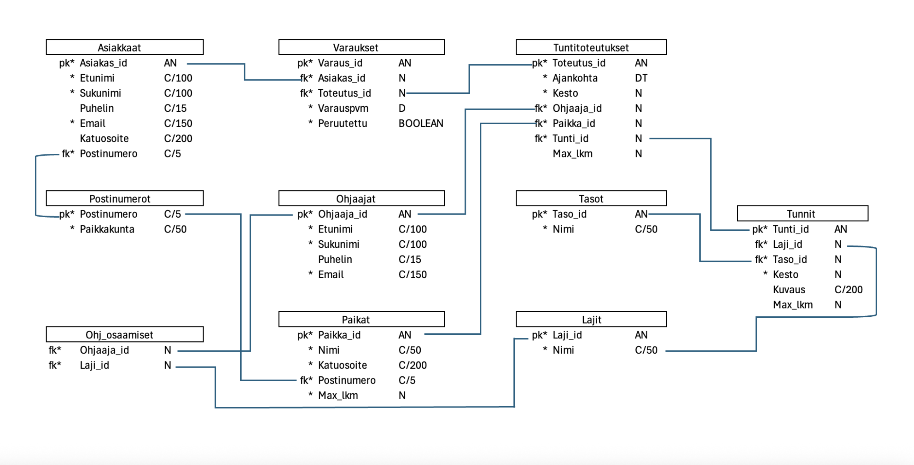
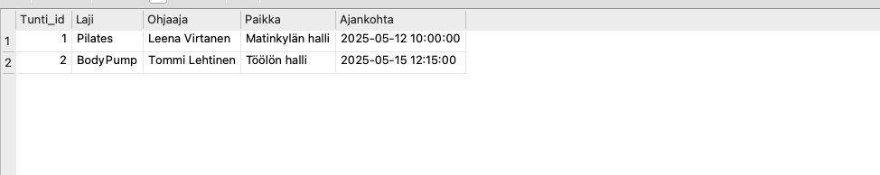

# SQLite Fitness Class Booking Database

This project is a course assignment focused on designing a relational database for a fictional fitness studio group class booking system (Kunto Oy). The goal of the project was to design a clear and normalized database schema and implement it using SQLite.

The project is intentionally focused on database design and does not include an application layer or a user interface.

## Project Description

The database supports managing customers, instructors, classes, class types, difficulty levels, locations, scheduled fitness classes, and customer bookings.

It models relationships such as:

- customers booking scheduled classes
- instructors teaching specific class types
- classes having maximum capacities and difficulty levels
- classes being scheduled at specific locations and times

The database consists of the following main tables:

- **Postinumerot** as Postal codes and cities
- **Asiakkaat** as Customers
- **Ohjaajat** as Instructors
- **Lajit** as Fitness class types
- **Tasot** as Difficulty levels
- **Paikat** as Fitness studio locations
- **Tunnit** as Class definitions
- **Tuntitoteutukset** as Scheduled class sessions
- **Varaukset** as Customer bookings
- **Ohj_osaamiset** as Junction table linking instructors and class types (many-to-many)

## Data Model

The data model is shown below:



Below is an example SQL query that lists all upcoming class sessions with their class type, instructor, location and scheduled time:

```sql
SELECT
    t.Tunti_id,
    l.Nimi AS Laji,
    o.Etunimi || ' ' || o.Sukunimi AS Ohjaaja,
    p.Nimi AS Paikka,
    tt.Ajankohta
FROM Tuntitoteutukset tt
JOIN Tunnit t ON tt.Tunti_id = t.Tunti_id
JOIN Lajit l ON t.Laji_id = l.Laji_id
JOIN Ohjaajat o ON tt.Ohjaaja_id = o.Ohjaaja_id
JOIN Paikat p ON tt.Paikka_id = p.Paikka_id
ORDER BY tt.Ajankohta;
```

Here is the result of the given query:



## Technologies Used

- SQL
- SQLite
